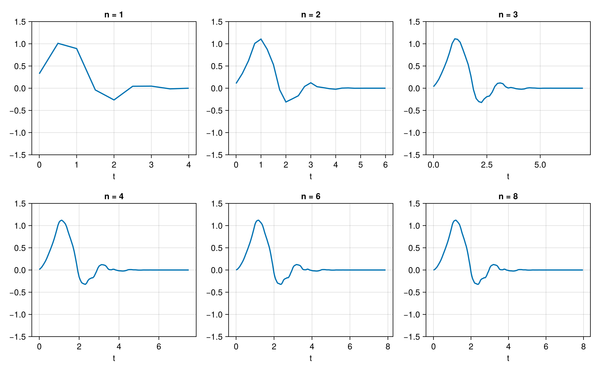
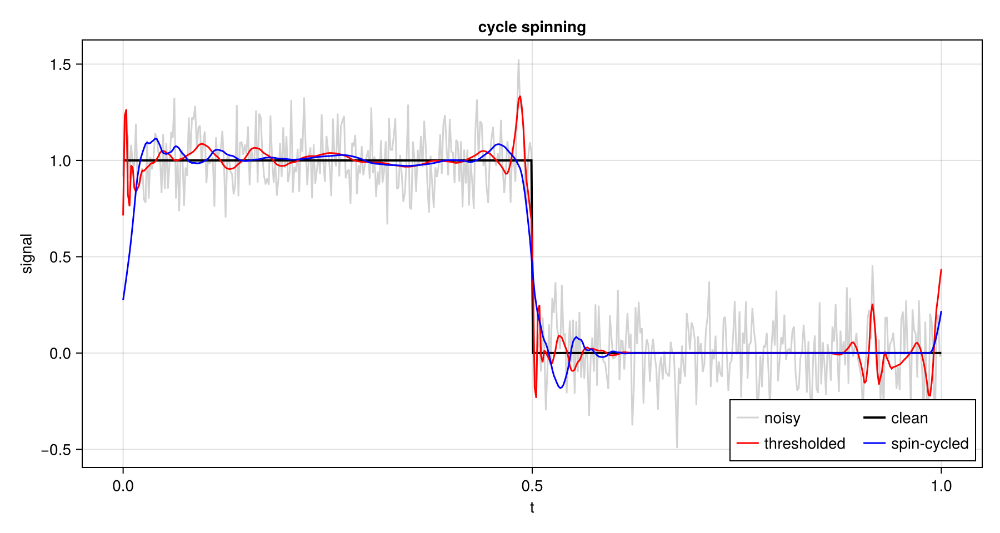
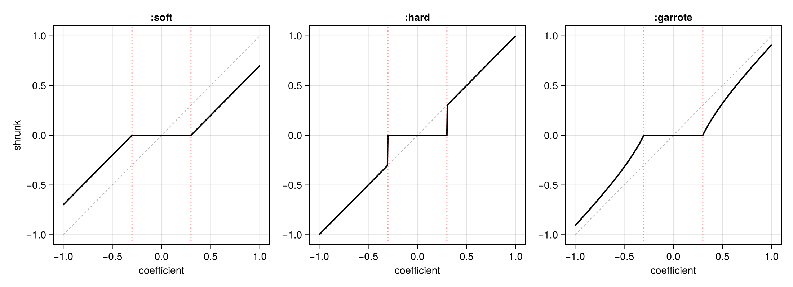
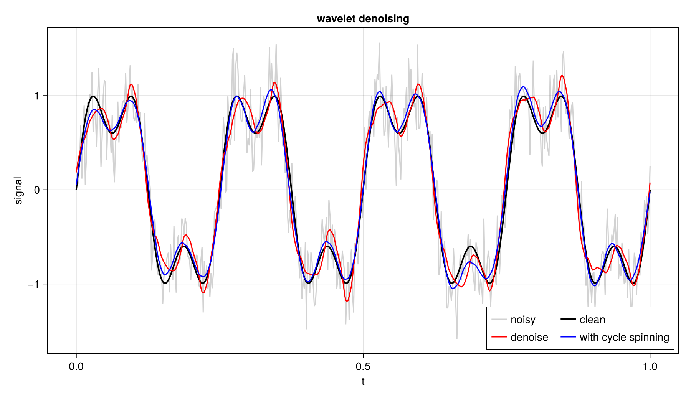
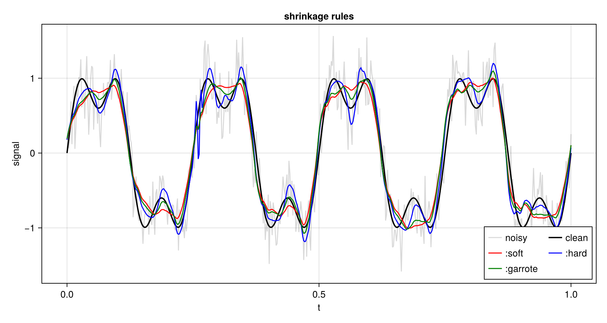
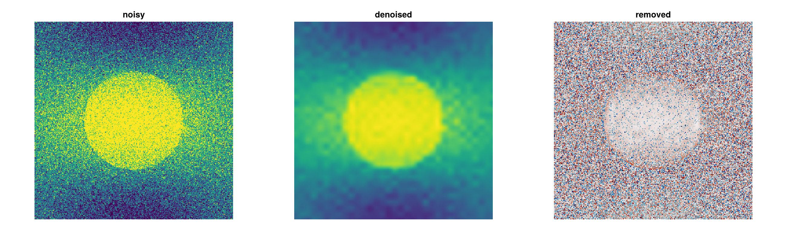

# Algorithms

## The cascade algorithm

[`cascade`](@ref) calculates an iterative approximation to the equivalent continuous-time wavelet.
Each step doubles the resolution. By default, 8 iterations are applied.

```julia
using NDWaveletTransforms

φ, ψ = cascade(WT_D4, 8)
t = (0:length(φ) - 1) ./ 2^8     # samples at k / 2^8
```



## Cycle-spinning

Decimating wavelet transforms are phase-sensitive; this can introduce
pseudo-Gibbs phenomenon and incomplete sparse representation. One common
approach to this problem is _cycle-spinning_: repeating a particular wavelet-domain
operation multiple times to the same signal at different shifts. This suppresses
Gibbs phenomenon and helps to expose additional sparse structure.

This cyclespinning loop is executed `n` times on `x` passing the callback function `f` to `cyclespinning!(f, x, n = 4)`. The callback is responsible for transforming the signal (as there are multiple possible transforms). The shifts are the primes from `prime(start + 1)` upward.

```julia
function denoise!(x)
    dwt!(x, WT_D4, 4)
    x[abs.(x) .< 0.1 * maximum(abs.(x))] .= 0
    idwt!(x, WT_D4, 4)
    return x
end

plain = denoise!(copy(noisy))
spun = copy(noisy)
cyclespinning!(denoise!, spun, 8)
```




The thresholded signal overshoots at the step and at the boundary, where
the periodic wrap-around lives. The spin-cycled result follows the step
more closely and rings less.

## Denoising

[`denoise`](@ref) is a convenience function applying shrinkage denoising to signals. This is done by

1. Forward-transforming the signal,
2. Applying thresholding,
3. Inverse-transforming.

Cycle-spinning can optionally be applied.

### Shrinking coefficients

[`threshold!`](@ref) applies one of three rules given threshold `λ`:

- `:soft` subtracts `λ` from the magnitude. The rule is continuous, which
  keeps the estimate smooth, but it biases every coefficient toward zero.
- `:hard` keeps a coefficient or zeroes it. It is unbiased for large
  coefficients and leaves ringing at sharp features.
- `:garrote` sits between the two, `x (1 - λ^2 / |x|^2)`.



### Choosing the threshold

The default rule is `:universal`, `λ = σ sqrt(2 log n)`, with `σ` estimated
from the finest detail band by [`noisiness`](@ref), which is the median
absolute deviation divided by `0.6745`. `:sure` minimises Stein's unbiased
risk estimate instead. Only detail coefficients are thresholded.

`cycles > 0` averages the estimate over circular shifts with
[`cyclespinning!`](@ref).

```julia
s_denoised = denoise(s, WT_D4, 4)
s_smooth   = denoise(s, WT_D4, 4; cycles = 8)
```



The rules trade bias against ringing:



### Denoising 2-D Signals

Denoising works on images. The noise estimate uses every finest-scale
detail subband. The threshold applies to all of them.

```julia
img_denoised = denoise(noisy_img, WT_D4, 3)
```



[`compress`](@ref) is the same construction with a fixed coefficient budget
rather than a threshold.
