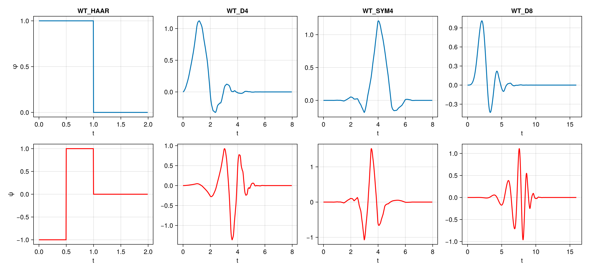
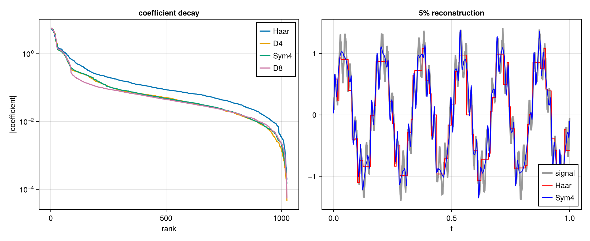
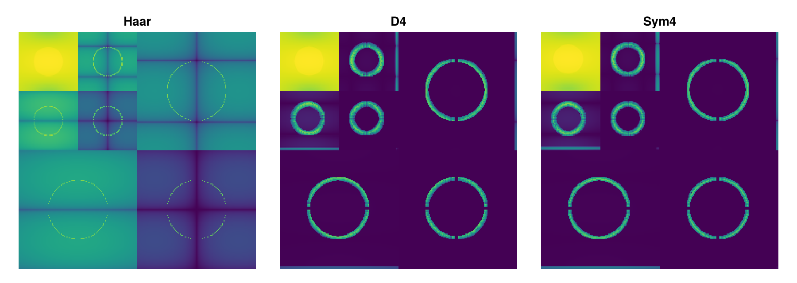

# Bases

At the moment, only orthogonal bases are supported.

Every basis is orthogonal and represented by a `WTOrthogonalBasis`, which
contains scaling and wavelet filters as static vectors.

The wavelets currently supported are given in the following table.

| Kind | Symbols |
|---|---|
| Haar | `WT_HAAR` |
| Daubechies, `n` vanishing moments | `WT_D1` ... `WT_D20` |
| Coiflets | `WT_COIF2` ... `WT_COIF10` |
| Symlets | `WT_SYM2` ... `WT_SYM10` |
| Battle-Lemarie | `WT_BATTLE2`, `WT_BATTLE4`, `WT_BATTLE6` |
| Beyl | `WT_BEYL` |
| Vaidyanathan | `WT_VAID` |
| Morris minimum-bandwidth | `WT_MB42`, `WT_MB82`, `WT_MB83`, `WT_MB84`, `WT_MB103`, `WT_MB123`, `WT_MB143`, `WT_MB163`, `WT_MB183`, `WT_MB243`, `WT_MB323` |
| Fejer-Korovkin | `WT_FK4`, `WT_FK6`, `WT_FK8`, `WT_FK14`, `WT_FK18`, `WT_FK22` |
| Best-localised Daubechies | `WT_BL7`, `WT_BL9`, `WT_BL10` |
| Han | `WT_HAN23`, `WT_HAN33`, `WT_HAN45`, `WT_HAN55` |

## The functions behind the filters

By the cascade algorithm, filters generate scaling and wavelet functions.
For a given basis, [`cascade`](@ref) generates these functions, e.g.

```julia
φ, ψ = cascade(WT_D4, 8)
```



Filters with more vanishing moments yield smoother functions, as higher derivatives of their
scaling and wavelet functions are bounded. However, this also yields wider support and phase sensitivity.

## Choosing a basis

Different signals are best approximated in different bases, depending on their characteristics.
The next figure shows coefficient magnitudes for a transformed signal under a few different bases;
note their different decay properties. An approximation to the signal, using the 5% of coefficients
with largest magnitude, is also shown. The classic blockiness of the Haar transform is clearly seen;
on the other hand, the Sym4 wavelet more accureately captures smooth HF energy as it has more vanishing moments.



The transform of the 2D signal from the "examples" section shows the Haar transform
failing to sparsify smooth variation in the signal.



For a number rather than a picture, [`sparsity`](@ref) summarises how well a
basis concentrates a signal, and [`rtenergy`](@ref) gives the energy of each
subband.

## DIY Wavelet Bases

Wavelet bases and transforms can be specified by the user from PR-QMF taps.
Either scaling or wavelet taps can be specified; the "flip-and-reverse" trick
is used to calculate the corresponding orthogonal filter. These must be
passed to the constructor as static arrays, like so:

```julia
using StaticArrays

my_haar = WTOrthogonalBasis(φ = SA[1.0, 1.0])
my_d4 = WTOrthogonalBasis(φ = SA[0.2303778, 0.7148466, 0.6308808, -0.0279838,
                              -0.1870348, 0.0308414, 0.0328830, -0.0105974])
```


