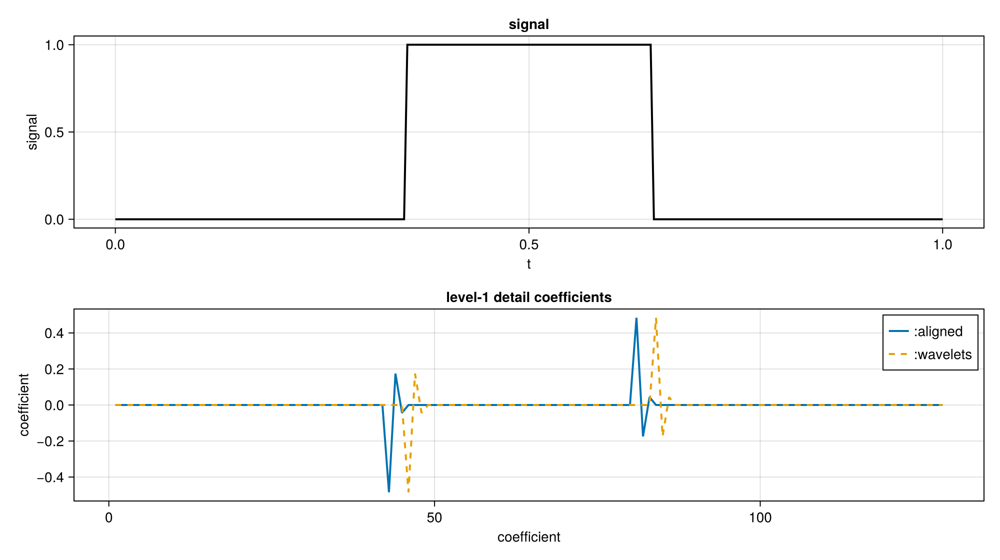
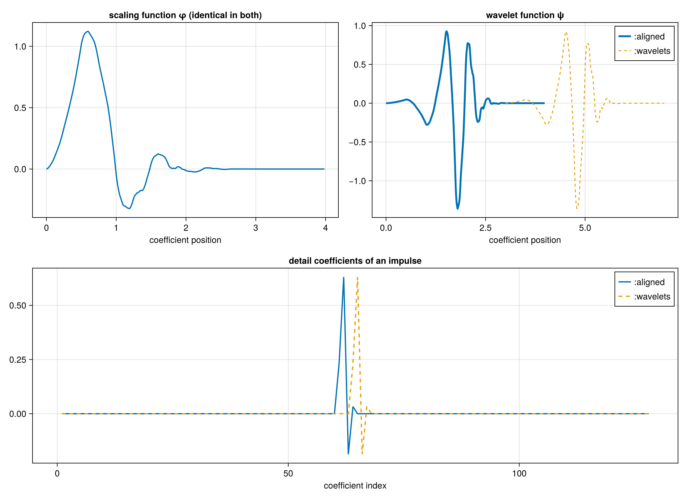

# Phase conventions

There are two phase conventions in the wavelets literature. The scaling coefficients are the same in both conventions. Detail coefficients differ by a cyclic rotation. Both yield perfect reconstruction.


Every transform takes a `convention` keyword:

- `:aligned` (default) applies scaling and wavelet filters to the same input
    window. This matches PyWavelets and MATLAB-style implementations.
- `:wavelets` reproduces the coefficient layout of Wavelets.jl. The ψ
  window starts `ntaps - 2` taps before the φ window, so each detail band
  is the aligned one rotated by `(ntaps - 2) / 2`.

`convention` is dispatched at compile time, so neither choice costs anything at run time.

```julia
x = rand(1024)
a = dwt(x, WT_D4, 3; convention = :aligned)    # default
b = dwt(x, WT_D4, 3; convention = :wavelets)   # matches Wavelets.jl

idwt!(a, WT_D4, 3; convention = :aligned)      # round trips
```


## Example: 1-D transform



## Example: 1-D transform

We take a four-level `WT_D8` transform. The first panel is the image.
The middle and right panels are the same coefficients under the two conventions,
with the subband boundaries drawn. The detail bands are displaced; displacement grows with depth.


## Basis view of the phase convention

To illustrate the effect of phase, [`cascade`](@ref) is run with detail coefficients
shifted by `(ntaps - 2) / 2` indices relative to the approximation coefficient.


