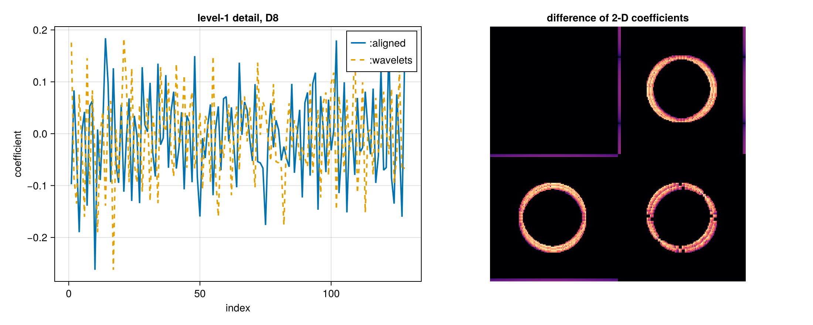

# Phase conventions

The scaling coefficients are the same in both conventions. Only the detail
coefficients differ, by a cyclic rotation.

Every transform takes a `convention` keyword:

- `:aligned` (the default) applies the scaling filter φ and the wavelet
  filter ψ to the same input window. This is the textbook phase, and
  matches PyWavelets and MATLAB-style implementations.
- `:wavelets` reproduces the coefficient layout of Wavelets.jl. The ψ
  window starts `ntaps - 2` taps before the φ window, so each detail band
  is the aligned one rotated by `(ntaps - 2) / 2`.

For a two-tap filter the two coincide. For longer filters they describe
the same transform with the detail coefficients shifted.

```julia
x = rand(1024)
a = dwt(x, WT_D4, 3; convention = :aligned)    # default
b = dwt(x, WT_D4, 3; convention = :wavelets)   # matches Wavelets.jl

idwt!(a, WT_D4, 3; convention = :aligned)      # round trips
```

`convention` is dispatched at compile time, so neither choice costs
anything at run time. Use `:aligned` unless you need to match Wavelets.jl
or reproduce a coefficient layout computed elsewhere.



The left panel shows the level-1 detail band of a one-dimensional D8
transform under both conventions; the two sequences are the same, rotated
by three samples. The right panel is the difference of a two-dimensional
level-1 D4 transform. The approximation band in the top-left corner is
exactly zero, because the scaling coefficients agree; the detail bands are
where the two conventions part ways.
