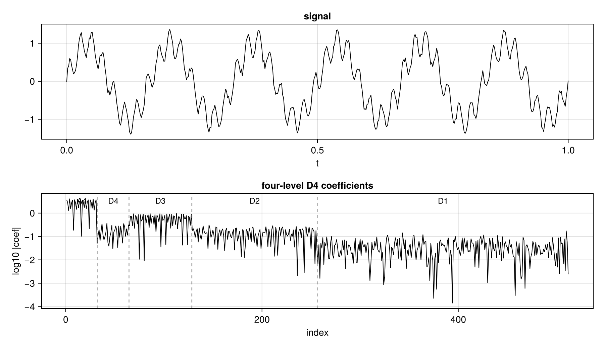
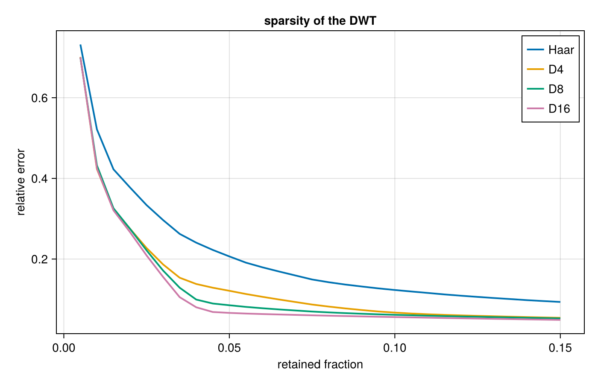
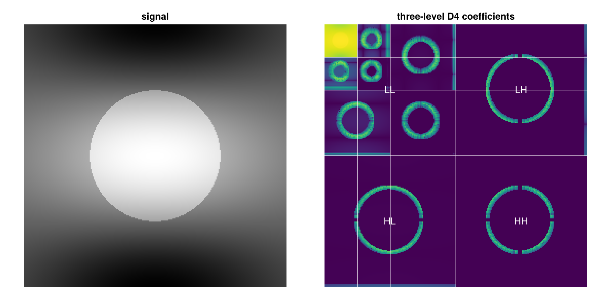
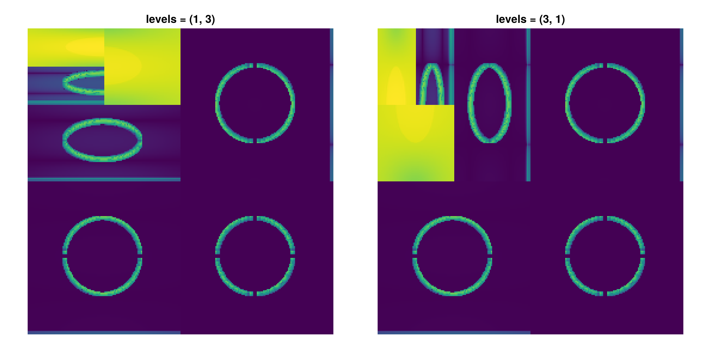
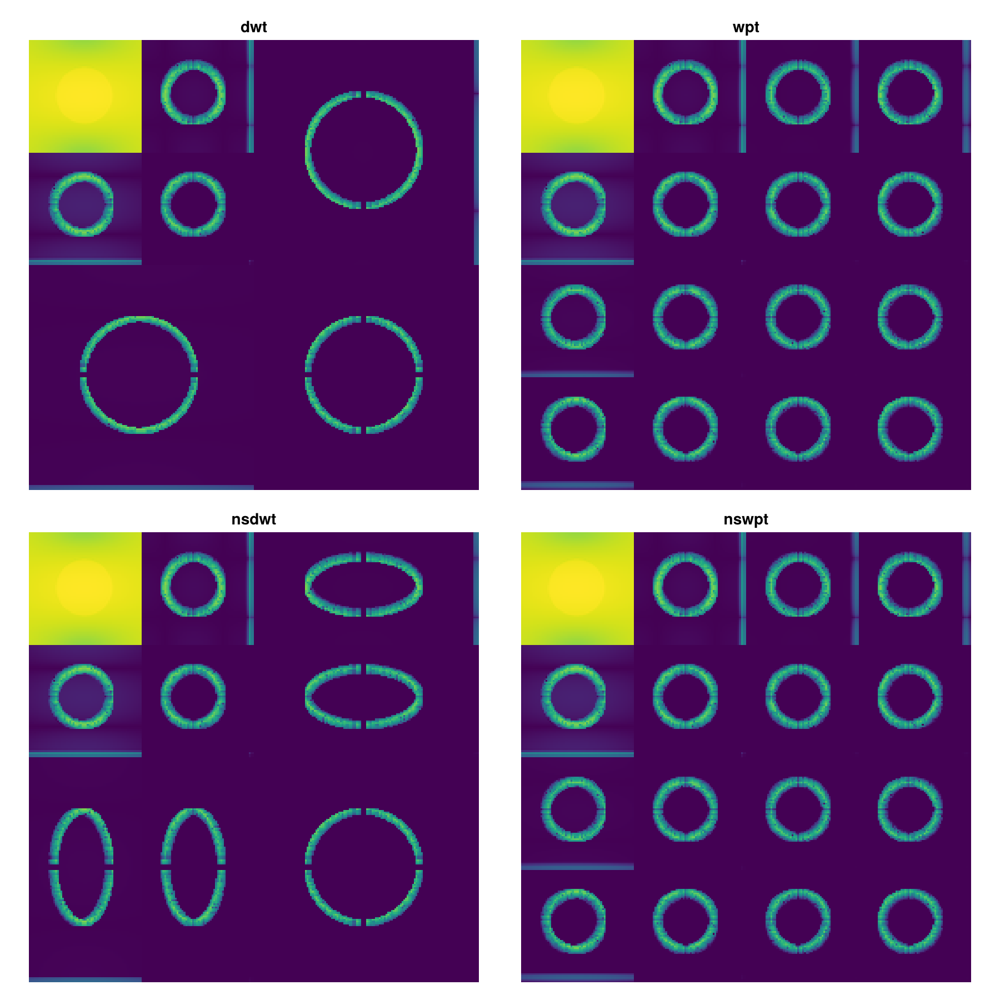

# Examples

## A one-dimensional signal

A four-level D4 transform splits a signal into one approximation band and
four detail bands. Thresholding the detail bands removes noise while
keeping the part of the signal that is smooth.

```julia
using NDWaveletTransforms
using Random

Random.seed!(1)
t = range(0, 1, length = 2048)
s = sin.(2pi .* 6 .* t) .+ 0.35 .* sin.(2pi .* 45 .* t) .+ 0.05 .* randn(2048)

c = dwt(s, WT_D4, 4)

cut = copy(c)
cut[abs.(cut) .< 0.1] .= 0     # drop the small coefficients
s_denoised = idwt(cut, WT_D4, 4)
```

Bands are named by their path from the root of the tree, low or high at
each level, so the strip below reads `LLLL`, `LLLH`, `LLH`, `LH`, `H` from
coarsest to finest.



## Sparsity

Smooth signals keep most of their energy in a few wavelet coefficients, and
the rest decay quickly. Keeping the largest coefficients and zeroing the
rest reconstructs the signal to a relative error that falls fast with the
fraction kept. Longer filters do better on smooth signals; Haar does worse,
and pays for it with a blocky reconstruction.



## Denoising

[`denoise`](@ref) and the coefficient shrinkage functions are covered on the
[Algorithms](@ref) page.

## An image

```julia
img = rand(512, 512)
c = dwt(img, WT_D4, 3)

mags = sort(abs.(c); rev = true)
k = round(Int, 0.05 * length(c))
compressed = copy(c)
compressed[abs.(compressed) .< mags[k]] .= 0
img_compressed = idwt(compressed, WT_D4, 3)
```

The coefficient array is a mosaic: a coarse approximation in the top-left
corner, and progressively finer detail bands around it.



## Levels along each axis

The level argument can be a tuple, one entry per axis, so a rectangular
array can be transformed more deeply along its long axis than its short
one, or left alone along an axis that is already smooth.

```julia
img = rand(256, 256)
dwt(img, WT_D4, (1, 3))    # one level along axis 1, three along axis 2
dwt(img, WT_D4, (3, 1))    # the other way round
```



## The four families

The prefix selects the recursion: `dwt` and `wpt` are the standard and
wavelet-packet forms. The `ns` prefix selects the nonstandard ordering,
which applies every level along one axis before moving to the next.

```julia
img = rand(128, 128)
dwt(img, WT_D4, 2)     # standard
wpt(img, WT_D4, 2)     # every subband recurses
nsdwt(img, WT_D4, 2)   # nonstandard ordering
nswpt(img, WT_D4, 2)   # both
```



The packet transform subdivides every subband, so the array is a full
quad-tree rather than a corner of repeated approximation. The nonstandard
ordering leaves a different arrangement in the detail bands.

A packet transform inverts with `iwpt` and a nonstandard one with
`nsidwt`:

```julia
x = rand(256)
c = wpt(x, WT_D4, 3)
iwpt!(c, WT_D4, 3)
c ≈ x
```
